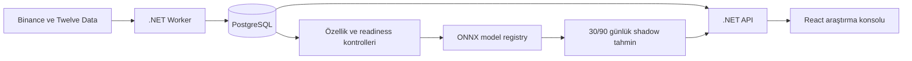

# Probora

Probora; 8 kripto varlığı ile 20 yüksek likiditeli ABD hissesi/ETF için 30 ve 90 günlük
olasılıksal piyasa araştırması üreten, modelin ne bildiğini ve nerede emin olmadığını açıkça
gösteren bir quant araştırma platformudur.

> Probora yatırım tavsiyesi vermez, kişisel portföy önermez ve otomatik işlem yapmaz. Model,
> veri veya güven kapıları yeterli değilse yön sinyali yayınlamaz.

## Bugünkü durum

- 28 varlık tek API ve tek araştırma arayüzünde izleniyor.
- Kripto verileri Binance REST/WebSocket, ABD EOD verileri Twelve Data üzerinden toplanıyor.
- 30 ve 90 günlük modeller shadow modunda gerçek tahmin ve olgunlaşan etiket biriktiriyor.
- Geçmiş tahminler, kullanılan model sürümü, özellik şeması ve kanıt kayıtları denetlenebilir.
- Production yayını; Brier, kalibrasyon, interval coverage, veri kalitesi ve canlı shadow
  kapıları geçilmeden açılmıyor.

Repo model artifact'larını, ham büyük veri setlerini, yerel `.env` dosyalarını veya veritabanı
yedeklerini içermez.

## Arayüz

React tabanlı koyu tema araştırma konsolunda şu sayfalar bulunur:

- Genel Bakış: gerçek sistem sayaçları, BTC grafiği ve mevcut model görünümü.
- Varlıklar: 8 kripto + 20 ABD varlığı, veri/model durumları ve detay bağlantıları.
- Varlık Detayı: gerçek fiyat serisi, 30/90 gün olasılıkları, getiri aralığı, risk ve kanıtlar.
- Shadow Tahminler: tahmin sayısı ile etiket olgunlaşmasını ayrı gösteren canlı takip ekranı.
- Model Performansı: Brier, kalibrasyon, baseline ve promotion kapıları.
- Veri Sağlığı: cutoff/readiness, gecikme ve kalite olayları.
- Sistem Akışı: veri kaynağından tahmine kadar etkileşimli mimari.
- Ayarlar: sistem sınırları ve ürün bildirimleri.

Arayüz örnek değer üretmez. API'de veri yoksa yükleniyor, boş veya hata durumunu açıkça gösterir.

## Mimari



| Katman | Teknoloji | Sorumluluk |
|---|---|---|
| API ve worker | .NET 10, Quartz, ONNX Runtime | Veri toplama, cutoff, inference, audit API |
| Model hattı | Python, LightGBM, scikit-learn, ONNX | Özellik, purged walk-forward, kalibrasyon, export |
| Veri | PostgreSQL, DVC, MinIO/MLflow | Operasyonel kayıt, veri sürümü, deney ve artifact |
| Web | React 19, TypeScript, Vite, Recharts | Responsive araştırma ve şeffaflık arayüzü |
| Dağıtım | Docker Compose, Caddy | Yerel ve domainsiz VPS çalıştırma |

## Depo yapısı

```text
src/                  .NET domain, API, worker, persistence ve ONNX runtime
tests/                .NET birim testleri
ml/                   Özellik, etiket, backtest, eğitim, kalibrasyon ve ONNX export
web/probora-web/      React 19 + TypeScript + Vite istemcisi
infra/                Caddy, PostgreSQL, OpenTelemetry ve container tanımları
docs/                 Model yönetişimi, veri kaynakları ve ürün sınırları
```

## Docker ile yerel başlangıç

Gereksinim: Docker Desktop veya Docker Engine.

```powershell
Copy-Item .env.example .env
docker compose up -d --build
```

Uygulama [http://localhost](http://localhost), readiness endpoint'i
`http://localhost/health/ready`, MLflow ise yalnızca yerel makineden
`http://localhost:5000` adresinde açılır.

Gerçek ABD verisi için `.env` içinde `TWELVE_DATA_ENABLED=true` ve
`TWELVE_DATA_API_KEY=...` ayarlanmalıdır. Gizli anahtarlar repoya eklenmemelidir.

## Model geliştirme

Gereksinim: Python 3.12/3.13. NVIDIA GPU varsa LightGBM CUDA/OpenCL yapılandırması ayrıca
doğrulanmalıdır; pipeline CPU üzerinde de çalışabilir.

```powershell
python -m venv .venv
.\.venv\Scripts\python.exe -m pip install -e ".\ml[dev,dvc]"
.\.venv\Scripts\probora-ml.exe build-dataset
.\.venv\Scripts\probora-ml.exe train
```

Eğitim hattı 30/90 günlük örtüşen etiketler için purging/embargo uygular; varlığa göre dinamik
volatilite bandı, walk-forward test, probability calibration, climatology blend ve rejim bazlı
hata analizini destekler. Üretilen artifact'lar `artifacts/models` altında yerel kalır.

## Doğrulama

```powershell
dotnet test Probora.slnx
.\.venv\Scripts\python.exe -m ruff check ml
.\.venv\Scripts\python.exe -m pytest ml
cd web/probora-web
npm run lint
npm test
npm run build
```

CI aynı .NET, Python ve web kontrollerine ek olarak bağımlılık güvenlik taraması ve container
build'i çalıştırır.

## VPS

Domainsiz dağıtım için [VPS rehberini](docs/vps-domainless-deployment.md) kullanın. Gateway
yalnızca VPS loopback arayüzüne bağlanır ve yerel bilgisayardan SSH tüneliyle açılır:

```bash
ssh -N -L 8090:127.0.0.1:8090 root@VPS_IP
```

## Production kapısı

Kodun çalışması modelin production'a hazır olduğu anlamına gelmez. Yayından önce:

- tarihsel veri ve feature parity kontrolleri tamamlanmalı,
- dış-test Brier ve kalibrasyon sonuçları baseline'ı geçmeli,
- 30 ve 90 günlük interval coverage kapıları sağlanmalı,
- en az 30 günlük shadow dönemde planlanan işlerin en az %99'u zamanında tamamlanmalı,
- performans volatilite/trend/mean-reversion gibi piyasa rejimlerinde ayrı incelenmeli,
- veri kullanım koşulları ve ürün metinleri hukuk uzmanı tarafından değerlendirilmelidir.

Detaylar: [model yönetişimi](docs/model-governance.md),
[veri kaynakları](docs/data-sources.md) ve
[ürün bildirimi](docs/legal-disclosure.tr.md).

## Yeniden adlandırma notu

Projenin güncel adı Probora'dır. Eski kurulumlardan gelen `parai-*` model sürüm kimlikleri ve
şema geçişindeki eski ad referansları, geçmiş audit kayıtlarını bozmamak için yalnızca uyumluluk
katmanında korunur. Yeni kayıtlar Probora adını kullanır.
